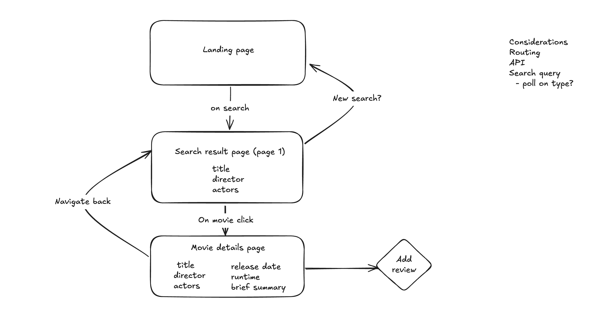

## Plan of attack:

### Components:

- Movie search listing
- Movie details
- Search component
- Reviews

Firstly want to understand the api and how it responds so will create a POC that fetches data from the api - Conclusion - searching the api returns a simplified movie, without actors/directors so would need to call search and
then additional api call for the additional information. Think this should be done in a listing component - Going to use tanstack for ease of use for api requests. This would allow greatest flexiblity to extend in future and
handles things like caching and pagination easily.

Need to consider how the search will work - dynamically update as typing or on search button click.

For routing will try and keep it simple with React-router which should also allow us to update history state as we click
through to the movie detail page

Going to use tailwind for ease of use and speed

Nice to have, use the posters to display the search results
(and coming soon for ones without images)

Getting duplicates in the api response
